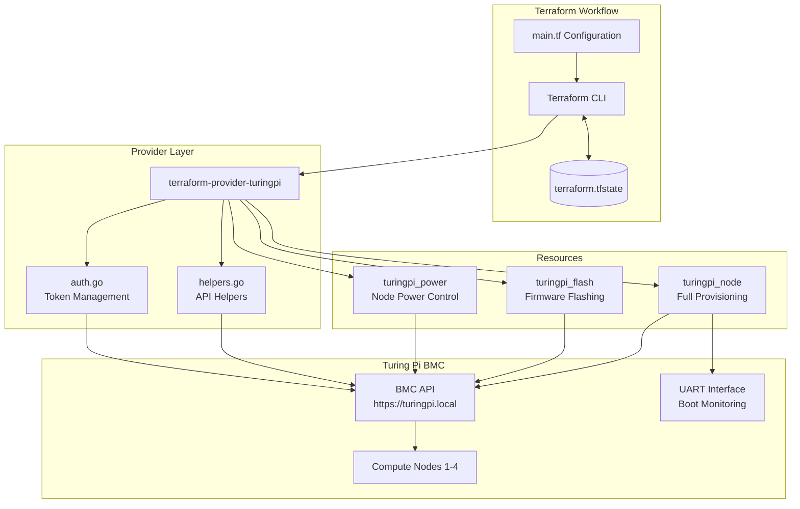
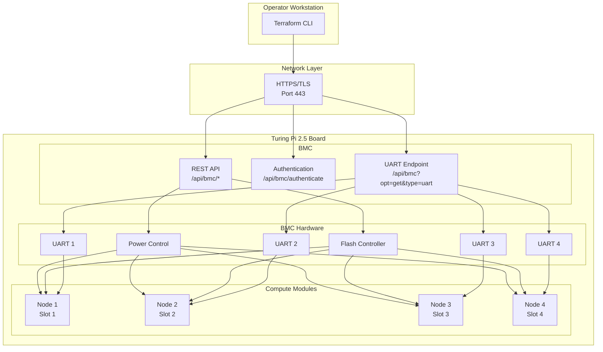
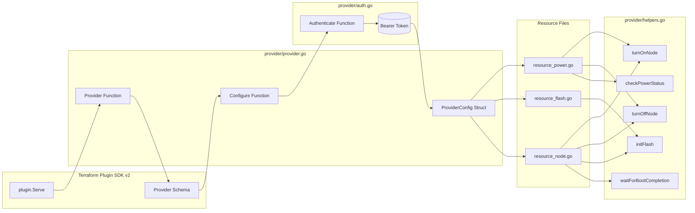
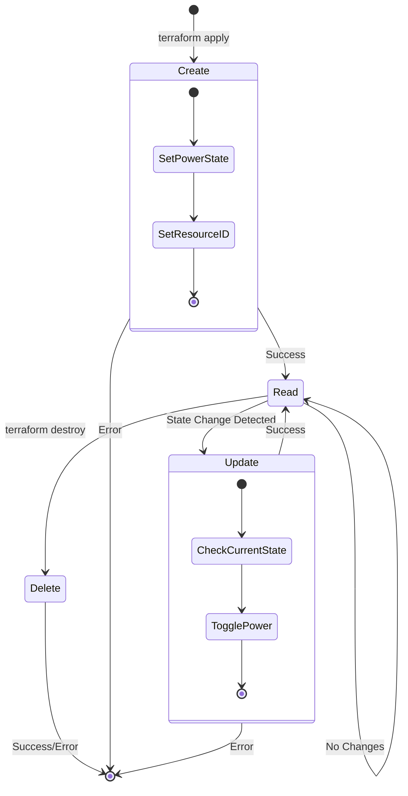
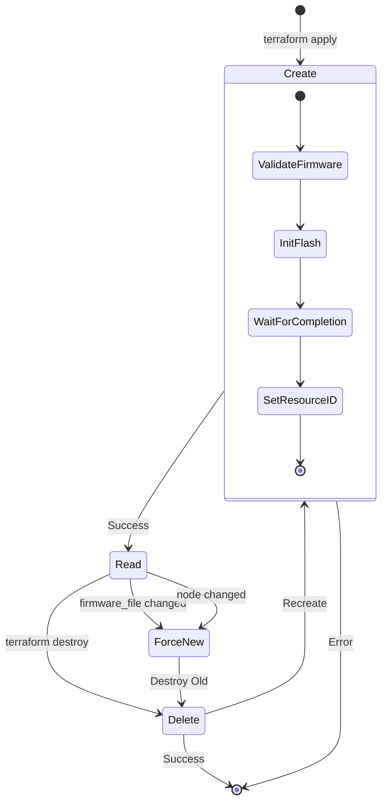
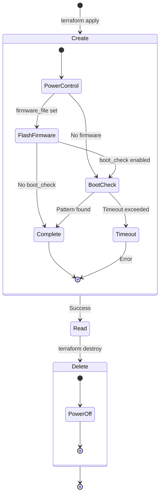
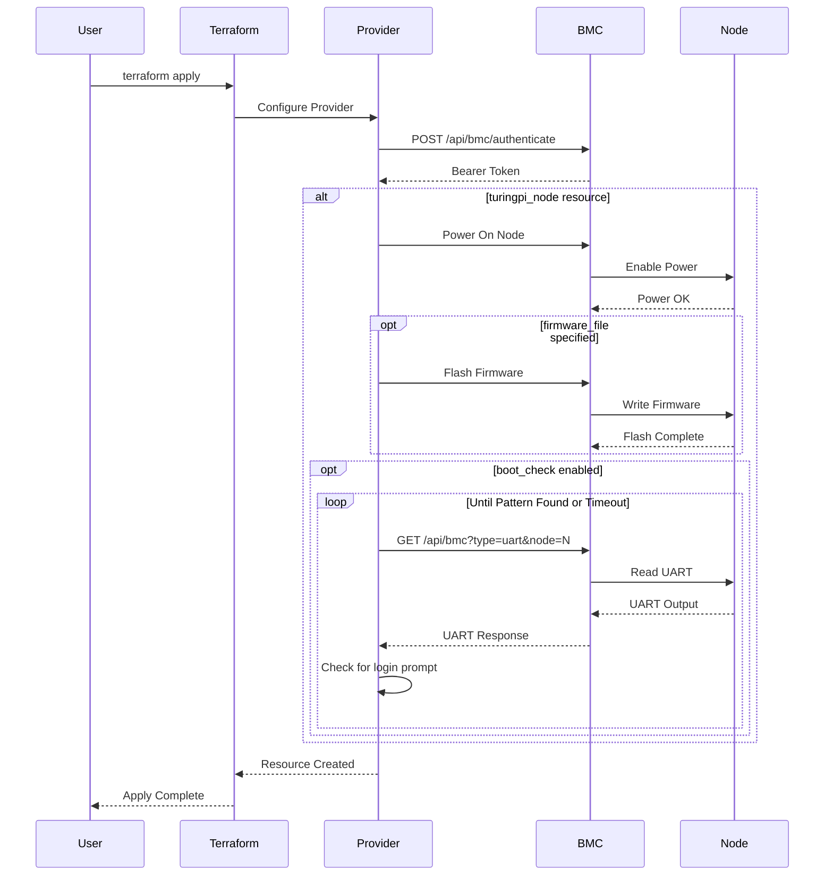
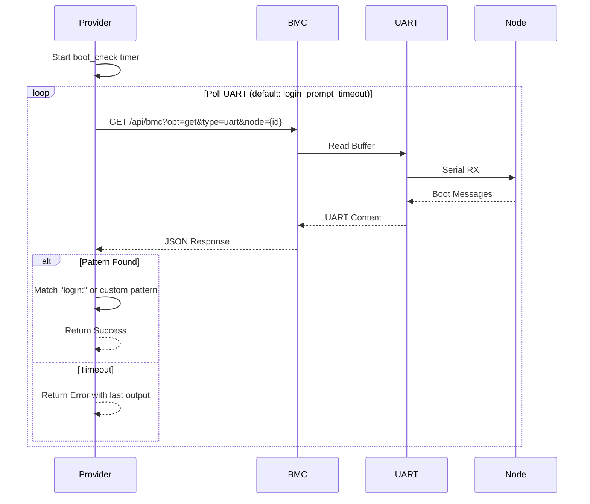
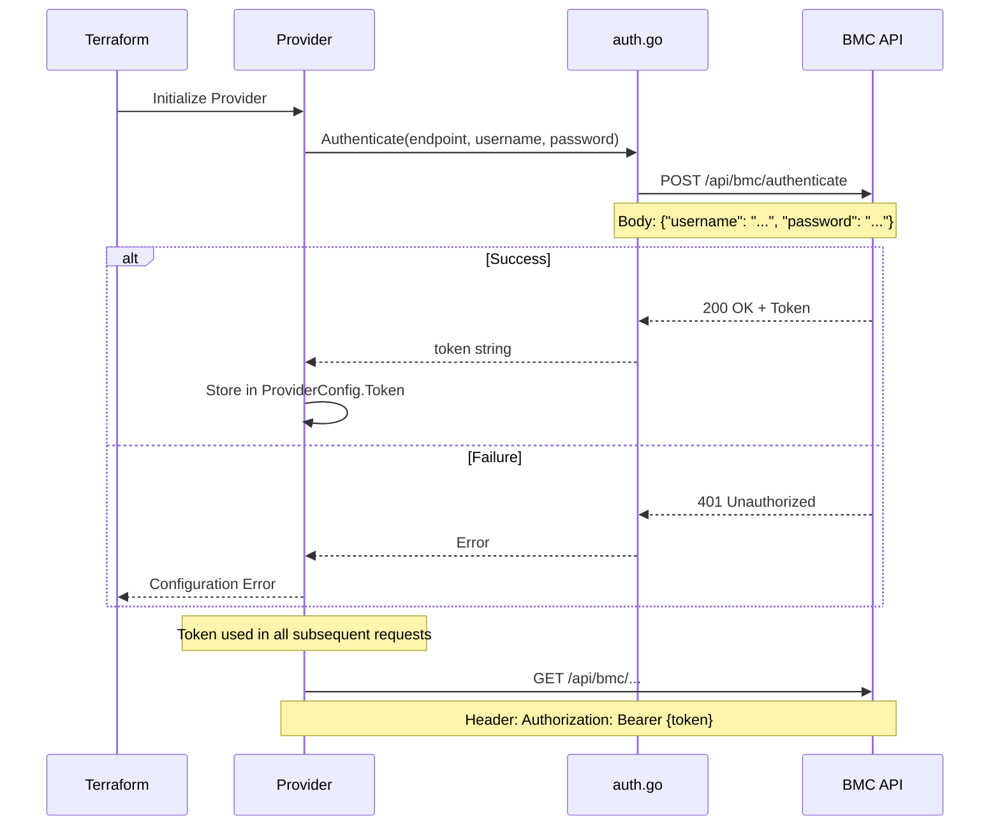

# Architecture Documentation

This document provides visual architecture documentation for the Turing Pi Terraform Provider.

## Table of Contents

1. [System Overview](#system-overview)
2. [Network Topology](#network-topology)
3. [Component Interaction](#component-interaction)
4. [Resource Lifecycle](#resource-lifecycle)
5. [Data Flow](#data-flow)
6. [Authentication Flow](#authentication-flow)

---

## System Overview



---

## Network Topology



---

## Component Interaction



---

## Resource Lifecycle

### turingpi_power Resource



### turingpi_flash Resource



### turingpi_node Resource (Composite)



---

## Data Flow

### Provisioning Workflow



### Boot Verification Detail



---

## Authentication Flow



---

## API Endpoints Reference

| Endpoint | Method | Purpose | Auth |
|----------|--------|---------|------|
| `/api/bmc/authenticate` | POST | Get bearer token | None |
| `/api/bmc?opt=get&type=uart&node={id}` | GET | Read UART output | Bearer |
| `/api/bmc?opt=set&type=power&node={id}&mode={0\|1}` | GET | Power control | Bearer |
| `/api/bmc?opt=set&type=flash&node={id}` | POST | Flash firmware | Bearer |

---

## Environment Variables

| Variable | Purpose | Default |
|----------|---------|---------|
| `TURINGPI_USERNAME` | BMC username | - |
| `TURINGPI_PASSWORD` | BMC password | - |
| `TURINGPI_ENDPOINT` | BMC URL | `https://turingpi.local` |

---

## File Structure

```
terraform-provider-turingpi/
├── main.go                 # Plugin entry point
├── provider/
│   ├── provider.go         # Provider schema and config
│   ├── auth.go             # Authentication logic
│   ├── helpers.go          # Shared API helpers
│   ├── resource_power.go   # Power control resource
│   ├── resource_flash.go   # Firmware flash resource
│   └── resource_node.go    # Combined provisioning resource
├── docs/
│   ├── index.md            # Registry documentation
│   └── resources/          # Resource documentation
├── examples/               # Usage examples
└── testing/                # Test configurations
```
